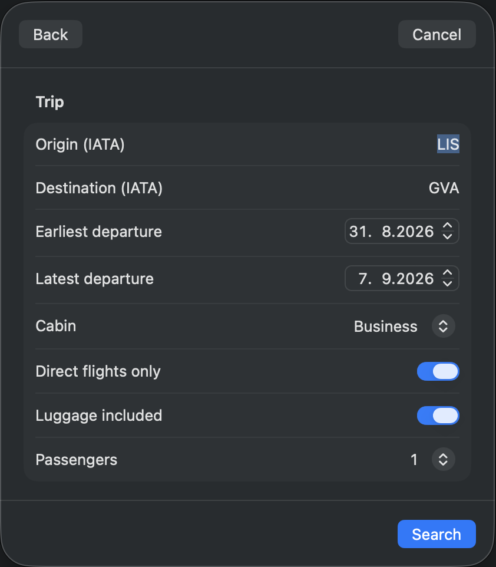
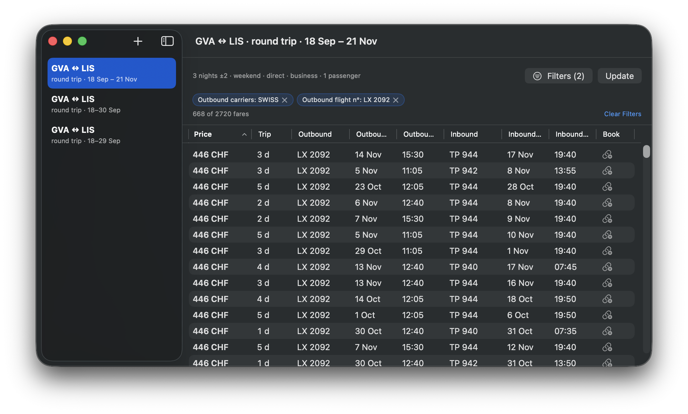

# Tarmac

Tarmac is a native macOS app (SwiftUI + SwiftData) for tracking airfare prices. Search one-way and round-trip fares with cabin class, max-stops, and airline filters; save searches for repeat use with full run history and price snapshots over time; and sweep a range of departure dates in a single run to find the cheapest day to fly.

## Features

- One-way and round-trip fare search with cabin class, max-stops, and airline filters
- Saved searches with run history and price snapshots over time
- Date-range sweeps in a single run — departure dates for one-way searches, a departure-by-duration matrix for round trips — each with a configurable per-run API-call cap
- Sortable, multi-column itinerary results table
- Result filters on price, date, carrier, times, duration, stops and flight number, plus trip length and return date and time for round trips
- Preferences pane for API key, market/currency, and airline restrictions

## Requirements

- macOS 14.6+
- Xcode
- An API key for [Ignav](https://ignav.com) — Tarmac fetches live fares through Ignav's fares API. Enter your key in **Tarmac → Preferences → API Key**.

## Screenshots

Round-trip search form:

Search results:

## License

MIT — see [LICENSE](LICENSE).
